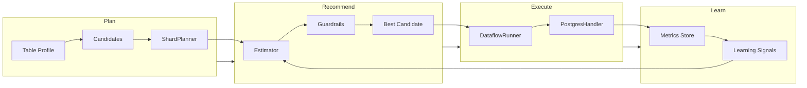
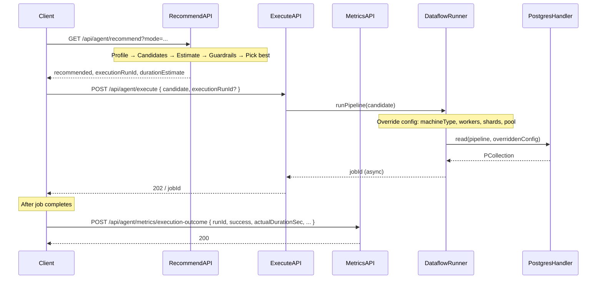
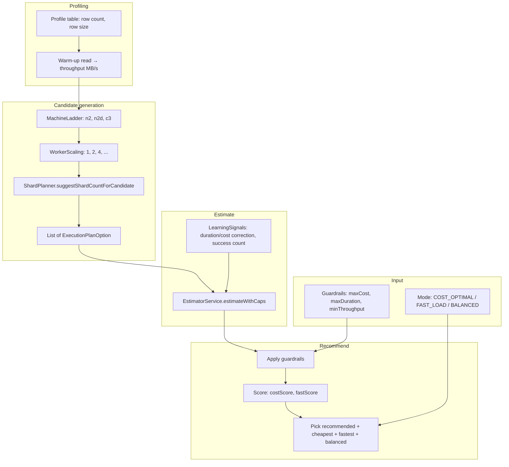
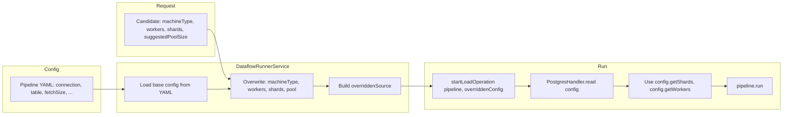
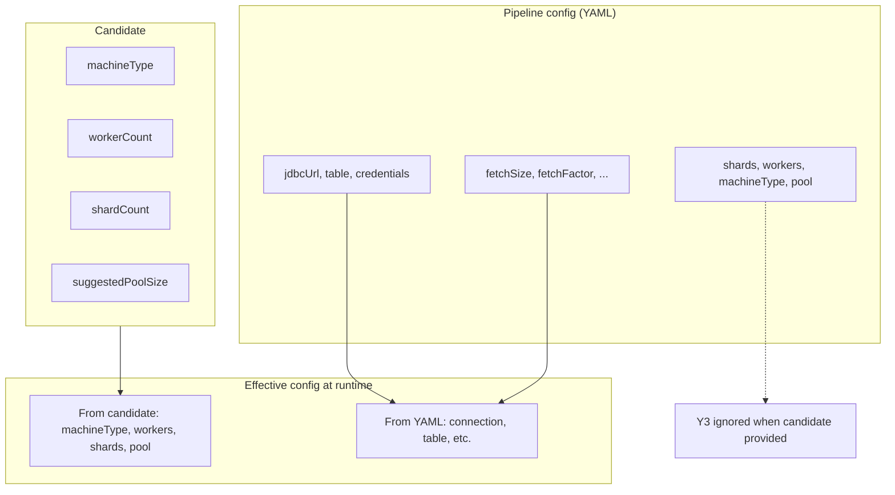
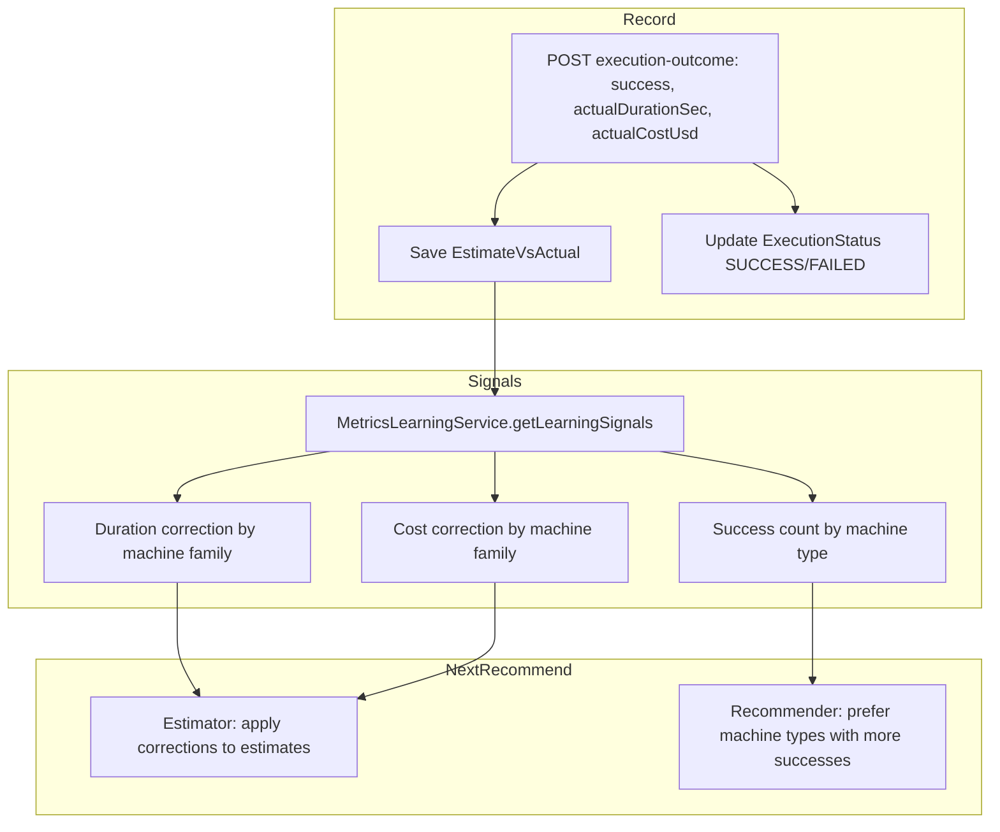
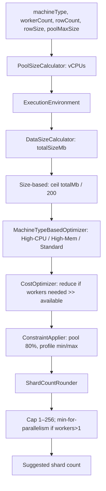

# StreamNova Agent – Design & Flow

High-level design and flow diagrams for the autonomous batch loading agent: **plan → recommend → execute → learn**.

---

## 1. High-Level Design

The agent orchestrates batch loads by:

1. **Plan** – Generate execution candidates (machine type, workers, shards) from table profile and shard planner.
2. **Recommend** – Estimate time/cost per candidate, apply guardrails, pick best by mode (COST_OPTIMAL / FAST_LOAD / BALANCED).
3. **Execute** – Run the pipeline with the chosen candidate; connection/table from config, execution plan from candidate.
4. **Learn** – Record estimates vs actuals and throughput; use learning signals to improve future estimates and prefer proven machine types.

---

## 2. Segment Overview

| Segment | Package | Purpose |
|--------|---------|---------|
| **Profiler** | `agent.profiler` | Table profile (row count, row size), warm-up throughput (MB/s) |
| **Candidate Generator** | `agent.execution_planner` | Machine ladder, worker scaling, ShardPlanner → list of candidates |
| **Estimator** | `agent.estimator` | Time & cost per candidate (source/CPU/sink caps, learning corrections) |
| **Recommender** | `agent.recommender` | Score candidates, apply guardrails, pick cheapest/fastest/balanced |
| **Execution Engine** | `agent.execution_engine` | POST /execute with candidate → DataflowRunnerService |
| **Metrics & Learning** | `agent.metrics` | Store estimates vs actuals, throughput, execution status; derive learning signals |

---

## 3. End-to-End API Flow

Typical user flow: **Recommend** → **Execute** → **Report outcome** (optional).

---

## 4. Recommend Flow (Internal)

What happens inside **GET /api/agent/recommend**:

- **Profile** – Row count, row size, optional warm-up throughput.
- **Candidates** – Machine types × worker counts; shard count from `ShardPlanner.suggestShardCountForCandidate(machineType, workers, rowCount, rowSize, poolSize)`.
- **Estimate** – Per-candidate duration and cost with source/CPU/sink caps; learning signals correct by machine family and prefer successful machine types.
- **Recommend** – Filter by guardrails, score, return recommended + cheapest + fastest + balanced.

---

## 5. Execute Flow (Candidate → Pipeline)

When **POST /api/agent/execute** is called with a candidate:

**Rule:** When a candidate is provided, **shards, workers, machineType, and pool** come **only from the candidate**. Pipeline config (YAML) is used only for **connection, table, and other read settings** (jdbcUrl, credentials, fetchSize, etc.).

---

## 6. Config Override (Candidate vs YAML)

So: **no reliance on pipeline config for shards, workers, machineType, or pool when the candidate supplies them**; we **still rely on pipeline config for connection, table, and all other read/source settings**.

---

## 7. Learning Loop

After runs complete, the agent uses outcomes to improve the next recommend.

- **Estimator** – Applies duration/cost correction factors per machine family (n2, n2d, c3) from past actuals.
- **Recommender** – Uses success count by machine type to break ties and prefer historically successful configs.

---

## 8. Shard Planning Flow

How shard count is chosen for each candidate (used in candidate generation and documented in SHARD_PLANNER_ARCHITECTURE.md):

---

## 9. Key REST Endpoints

| Method | Path | Purpose |
|--------|------|---------|
| GET | `/api/agent/recommend?mode=...` | Get recommended candidate + cheapest/fastest/balanced, executionRunId, durationEstimate |
| POST | `/api/agent/execute` | Run pipeline with candidate body; returns jobId (async) |
| POST | `/api/agent/metrics/execution-outcome` | Report run result (success, actualDurationSec, actualCostUsd) for learning |
| GET | `/api/agent/candidates/generate` | Generate candidates from profile (profile + generate) |
| GET | `/api/agent/metrics/table-statistics` | Chart-ready table statistics |

---

## 10. References

- **Agent design (segments, APIs)** – `src/main/java/com/di/streamnova/agent/README.md`
- **Execution engine** – `EXECUTION_ENGINE_STATUS.md`
- **Shard planner** – `SHARD_PLANNER_ARCHITECTURE.md`, `SHARD_PLANNER_PRODUCTION_READINESS.md`
- **Pipeline config** – event configs: `database_event_config.yml`, `gcs_event_config.yml`, `bq_event_config.yml`; or a single pipeline config file when not using event-configs-only (comment on candidate override)
