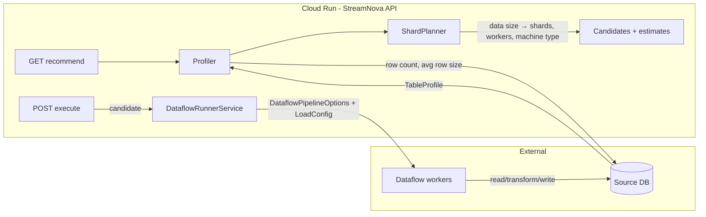

# Will StreamNova Work on Cloud Run?

**Short answer:** Yes, with configuration and deployment adjustments. The app is a stateless Spring Boot web API that submits work to Dataflow and uses env/Secret Manager for config—all compatible with Cloud Run. A couple of changes are required for the container contract and one behavioral caveat for long-running execute calls.

---

## How data size drives processing and how Cloud Run hands off to Dataflow

Cloud Run **does not process the actual table data**. It runs only the StreamNova API. Data size is used **on Cloud Run** to compute a recommended execution plan; that plan is then passed into **DataflowRunnerService**, which submits a job to **GCP Dataflow**. The real data read/transform/write runs on **Dataflow workers**, not on Cloud Run.

End-to-end flow:



**Step by step:**

1. **Data size input (on Cloud Run)**
   - Client calls **GET recommend** (with `source`).
   - [ProfilerService](src/main/java/com/di/streamnova/agent/profiler/ProfilerService.java) runs: it talks to the **source DB** (e.g. Postgres) to get **table statistics** (row count, avg row size) and optional warm-up throughput.
   - That produces a [TableProfile](src/main/java/com/di/streamnova/agent/profiler/TableProfile.java) (e.g. `rowCountEstimate`, `avgRowSizeBytes`).
   - All of this runs **on the Cloud Run instance**; only small metadata queries hit the DB, not the full table scan.

2. **Plan from data size (on Cloud Run)**
   - [AdaptiveExecutionPlannerService](src/main/java/com/di/streamnova/agent/execution_planner/AdaptiveExecutionPlannerService.java) generates **candidates** (machine type, worker count, shard count, pool size).
   - [ShardPlanner](src/main/java/com/di/streamnova/agent/shardplanner/ShardPlanner.java) / [UnifiedCalculator](src/main/java/com/di/streamnova/agent/shardplanner/UnifiedCalculator.java) use **data size** (row count + avg row size → total MB) to compute **shard count** (e.g. target MB per shard).
   - Estimator adds duration/cost per candidate.
   - Response returns a list of **ExecutionPlanOption** (e.g. `machineType`, `workerCount`, `shardCount`, `suggestedPoolSize`).
   - Still **all on Cloud Run**; no bulk data.

3. **Execute: Cloud Run → DataflowRunnerService → Dataflow**
   - Client calls **POST execute** with the chosen **candidate** (and source/target/intermediate).
   - Request is handled **on Cloud Run** by [ExecutionController](src/main/java/com/di/streamnova/agent/execution_engine/ExecutionController.java) → [ExecutionEngineService](src/main/java/com/di/streamnova/agent/execution_engine/ExecutionEngineService.java) → [DataflowRunnerService.runPipeline(candidate, selection)](src/main/java/com/di/streamnova/runner/DataflowRunnerService.java).
   - **DataflowRunnerService** (lines 182–279):
     - Builds **DataflowPipelineOptions**: `workerMachineType`, `maxNumWorkers` from the candidate; project/region from config.
     - Builds **LoadConfig** with the candidate's **shard count**, **workers**, **machineType**, **pool size** applied to the source config (connection/table stay from pipeline/event config).
     - Creates the Beam **Pipeline**, runs SOURCE_READ (e.g. [PostgresHandler](src/main/java/com/di/streamnova/handler/jdbc/postgres/PostgresHandler.java) which uses `config.getShards()` for parallel read), then INTERMEDIATE_WRITE / TARGET_WRITE.
     - Calls `pipeline.run()` → **submits the job to GCP Dataflow**.
     - Then `result.waitUntilFinish()` → **blocks the HTTP request** until the Dataflow job completes.

4. **Where data is actually processed**
   - **Dataflow workers** (GCP) run the Beam pipeline: they connect to the source DB (with the shard count from the candidate), read sharded data, and write to GCS/BigQuery etc.
   - **Cloud Run** only: (a) runs the API that computes the data-size-based plan, and (b) invokes DataflowRunnerService to build and submit the job. It does **not** stream or process the table data itself.

So: **"According to data size, data will be processed"** means the **recommendation** (shards, workers, machine type) is derived from data size on Cloud Run, and that **same plan** is passed into DataflowRunnerService and then to Dataflow. Dataflow runs the pipeline with that plan; Cloud Run's role is to produce the plan and submit the job.

---

## What already fits Cloud Run

- **Stateless HTTP service**: REST API (recommend, execute, pipeline-listener, profiler, etc.) with no requirement for local persistent storage.
- **Context path**: `server.servlet.context-path: /streamnova` is fine; health and APIs are under `/streamnova/actuator/*` and `/streamnova/api/*`.
- **Actuator**: Health, info, metrics, and Prometheus are exposed—suitable for Cloud Run health checks and monitoring.
- **Startup**: With `use-event-configs-only: true` (default in [application.yml](src/main/resources/application.yml)), no pipeline runs at startup; the app just starts the web server. No need to change this for Cloud Run.
- **Secrets/DB**: Uses env vars and Google Secret Manager ([OracleSecretReader](src/main/java/com/di/streamnova/util/OracleSecretReader.java)); you can supply config via Cloud Run env vars and/or Secret Manager.
- **Listen address**: Spring Boot's embedded Tomcat binds to all interfaces by default when `server.port` is set, so listening on `0.0.0.0` is satisfied.

---

## Required changes

### 1. Use the `PORT` environment variable

Cloud Run sets `PORT` (e.g. `8080`). Spring Boot does **not** map `PORT` to `server.port` automatically; it uses `server.port` or `SERVER_PORT`.

**Change:** In [src/main/resources/application.yml](src/main/resources/application.yml), set the server port from the environment with a default for local runs:

```yaml
server:
  port: ${PORT:8080}
  servlet:
    context-path: /streamnova
```

Without this, the app may listen on 8080 while Cloud Run sends traffic to the injected `PORT`, and the service will not receive requests.

### 2. Container image

There is no Dockerfile or Cloud Run deployment config in the repo. You need a container image to run on Cloud Run.

**Options:**

- **Dockerfile**: Multi-stage build that builds the app with Maven and runs `java -jar` for the built JAR (e.g. from `spring-boot-maven-plugin`). Use a JDK 17 base image and expose the port (documentation only; Cloud Run uses `PORT`).
- **Buildpacks**: Use `gcloud run deploy --source .` (or Google Cloud Buildpacks) so the platform builds and runs the app without a checked-in Dockerfile.

Either way, the **start command** should be the standard Spring Boot entrypoint (e.g. `java -jar streamnova-0.0.1-SNAPSHOT.jar` or whatever the built artifact is named). No need to pass `-Dserver.port` if `application.yml` uses `${PORT:8080}` as above.

### 3. Health check path (Cloud Run configuration)

Configure the Cloud Run service so startup/liveness probes use the actuator health endpoint. With the context path, the URL is:

- **Health:** `http://<container>:PORT/streamnova/actuator/health`

In Cloud Run, set the service's "Startup probe" / "Liveness probe" (or equivalent) to this path so the platform considers the instance ready and healthy.

---

## Important caveat: execute endpoint and request timeout

The **execute** flow is **synchronous** from the client's perspective:

- [ExecutionEngineService](src/main/java/com/di/streamnova/agent/execution_engine/ExecutionEngineService.java) calls `dataflowRunnerService.runPipeline(...)`.
- [DataflowRunnerService](src/main/java/com/di/streamnova/runner/DataflowRunnerService.java) does `pipeline.run()` then `result.waitUntilFinish()` (e.g. around lines 278–279, 318–319), so the HTTP request **blocks until the Dataflow job completes**.

Cloud Run enforces a **request timeout** (default 5 minutes, maximum 60 minutes). If a Dataflow job runs longer than the configured timeout, Cloud Run will return **504** and the client will not get the execute response, even though the job may still be running on Dataflow.

**Practical implications:**

- For **short jobs** (within the configured timeout): Running on Cloud Run works as-is.
- For **long jobs**: Either:
  - Increase Cloud Run request timeout up to 60 minutes and accept that jobs longer than that will 504, or
  - Refactor execute to be **async**: submit the Dataflow job, return the job ID immediately, and have clients poll Dataflow (or a separate status API) for completion. That would align with the "Async: submits the job and returns immediately" comment in [ExecutionController](src/main/java/com/di/streamnova/agent/execution_engine/ExecutionController.java) and avoid Cloud Run timeout limits.
  - Use a **metadata table** so job status can be updated and queried even after the request expires: see [DATAFLOW_JOB_METADATA_DESIGN.md](DATAFLOW_JOB_METADATA_DESIGN.md) and [DATAFLOW_JOB_METADATA_SCHEMA.sql](../src/main/resources/agent/metrics/DATAFLOW_JOB_METADATA_SCHEMA.sql). Insert a row when the job is submitted; a background poller can update status from the Dataflow API when the job completes.

---

## Optional: profile and env vars

- Set **active profile** via Cloud Run env: `SPRING_PROFILES_ACTIVE=postgres-sit` (or the profile you use).
- Provide DB and other settings via env vars (e.g. `POSTGRES_SIT_DATABASE`, `POSTGRES_SIT_USERNAME`, etc.) or by mapping Secret Manager secrets into env vars in the Cloud Run service.

---

## Access you need to use DataflowRunnerService

DataflowRunnerService submits Apache Beam pipelines to **Google Cloud Dataflow**. The app does not set credentials in code; it uses **Application Default Credentials (ADC)**. On Cloud Run, that is the **Cloud Run service account** (the one attached to the service). You need the following access.

### 1. Identity that runs StreamNova (e.g. Cloud Run service account)

Grant this identity the permissions below so it can **create and manage Dataflow jobs**.

| Purpose | IAM role (or equivalent permissions) |
|--------|--------------------------------------|
| Create, list, get, cancel Dataflow jobs | `roles/dataflow.developer` on the **project** (or at least the Dataflow region). Alternatively `roles/dataflow.admin` for full admin. |
| Use a custom worker service account | If you set a dedicated worker SA for Dataflow: `roles/iam.serviceAccountUser` on that **worker service account** so the job submitter can "act as" it. |

Config used by [DataflowRunnerService](src/main/java/com/di/streamnova/runner/DataflowRunnerService.java): `streamnova.dataflow.project` and `streamnova.dataflow.region`. If unset, Beam uses the project from ADC (and default region). Set these in `application.yml` or env so jobs go to the right project/region.

### 2. Dataflow worker service account (the pipeline runs as this)

Workers are the VMs that run the pipeline (read DB/GCS/BigQuery, write GCS/BigQuery). By default Dataflow uses the **Compute Engine default service account** in the project, or you can set a **custom worker service account** in `DataflowPipelineOptions`. That identity needs:

| Resource | Access needed |
|----------|----------------|
| **GCS** (staging, temp, and pipeline paths) | Read/write to the buckets used for staging, temp, and any source/sink paths (e.g. `gs://...` in event config). Typically `roles/storage.objectAdmin` (or `storage.admin`) on those buckets. |
| **BigQuery** (if pipeline reads or writes BQ) | At least `roles/bigquery.dataEditor` and `roles/bigquery.jobUser` (or equivalent) on the project/datasets used in [bq_event_config](src/main/resources/bq_event_config.yml) and templates. |
| **Compute** (worker VMs) | Usually handled by the Dataflow service agent; ensure the project has the Dataflow API and Compute enabled. |
| **Source database** (Postgres/Oracle) | Workers need **network path** to the DB (e.g. VPC / Private IP if DB is in GCP). DB credentials are provided via pipeline config (env, or Secret Manager). If workers resolve secrets at runtime, the **worker** SA needs `roles/secretmanager.secretAccessor` on the secret(s). |
| **Secret Manager** (if DB passwords in GSM, e.g. [OracleSecretReader](src/main/java/com/di/streamnova/util/OracleSecretReader.java)) | The identity that reads the secret (Cloud Run at startup, or workers if they call Secret Manager) needs `roles/secretmanager.secretAccessor` on the relevant secret(s). |

### 3. APIs to enable

- **Dataflow API** (`dataflow.googleapis.com`)
- **Compute Engine API** (for worker VMs)
- **Cloud Storage API** (if using GCS)
- **BigQuery API** (if using BigQuery sources or sinks)
- **Secret Manager API** (if using Secret Manager for credentials)

### 4. Short checklist

- **Cloud Run service account**: `roles/dataflow.developer` (or `dataflow.admin`) on the project; optional `roles/iam.serviceAccountUser` on worker SA if using a custom one.
- **Worker SA (default or custom)**: GCS and BigQuery access as above; Secret Manager access if workers or app resolve DB secrets from GSM; network to DB (VPC/Private IP) if source is Cloud SQL or on-prem via Private Connect.
- **Config**: Set `streamnova.dataflow.project` and `streamnova.dataflow.region` (or rely on ADC project and default region).

---

## Summary

| Area | Status |
| ------------ | -------------------------------------------------------------------------------------- |
| Port | Add `server.port: ${PORT:8080}` in application.yml |
| Container | Add Dockerfile or use `gcloud run deploy --source .` (buildpacks) |
| Health | Configure Cloud Run to probe `/streamnova/actuator/health` |
| Long execute | Either keep jobs under request timeout or refactor to async (submit and return job ID) |

With the port and container in place, and health checks pointed at the actuator, the application will run on Cloud Run. The only functional limitation is the synchronous execute endpoint versus Cloud Run's request timeout for long-running Dataflow jobs.
