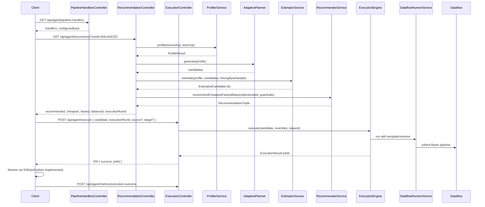
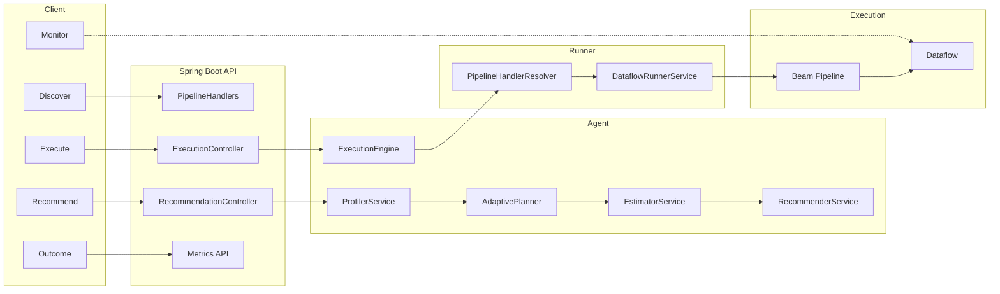

# StreamNova End-to-End Flow

## 1. Entry points

StreamNova has two ways to run a pipeline:

- **Startup (config-driven):** If `use-event-configs-only` is false, [StreamNovaApplication](../src/main/java/com/di/streamnova/StreamNovaApplication.java) calls `DataflowRunnerService.runPipeline()` after Spring Boot starts. The runner resolves source/intermediate/target from YAML and runs one Beam pipeline to completion.
- **API-driven (event configs):** When `use-event-configs-only` is true, no pipeline runs at startup. The React (or other) client drives the flow via **Discover → Recommend → Execute → Monitor** using REST.

The architecture brief in [StreamNova_Architecture_Brief.md](StreamNova_Architecture_Brief.md) and the agent [README](../src/main/java/com/di/streamnova/agent/README.md) describe the API-driven journey; below is the same flow with concrete classes and data flow.

---

## 2. API-driven flow (React / client)

---

## 3. Phase-by-phase (backend)

| Phase | API / trigger | Main classes | What happens |
|-------|----------------|--------------|--------------|
| **Discover** | `GET /api/agent/pipeline-handlers` | [PipelineHandlersController](../src/main/java/com/di/streamnova/agent/execution_engine/PipelineHandlersController.java) | Returns available source/target handlers and current config (from [PipelineConfigService](../src/main/java/com/di/streamnova/config/PipelineConfigService.java) / registry). |
| **Profile & recommend** | `GET /api/agent/recommend?mode=...` | [RecommendationController](../src/main/java/com/di/streamnova/agent/recommender/RecommendationController.java) | (1) [ProfilerService](../src/main/java/com/di/streamnova/agent/profiler/ProfilerService.java) profiles the table (row count, row size, optional warm-up throughput). (2) [AdaptiveExecutionPlannerService](../src/main/java/com/di/streamnova/agent/execution_planner/AdaptiveExecutionPlannerService.java) generates candidates (machine type, workers, shards). (3) [EstimatorService](../src/main/java/com/di/streamnova/agent/estimator/EstimatorService.java) estimates duration and cost per candidate (source/CPU/sink caps, learning signals). (4) [RecommenderService](../src/main/java/com/di/streamnova/agent/recommender/RecommenderService.java) + [GuardrailService](../src/main/java/com/di/streamnova/guardrail/GuardrailService.java) pick cheapest, fastest, balanced and apply guardrails. Returns `executionRunId` for the execute and outcome calls. |
| **Execute** | `POST /api/agent/execute` | [ExecutionController](../src/main/java/com/di/streamnova/agent/execution_engine/ExecutionController.java) → [ExecutionEngineService](../src/main/java/com/di/streamnova/agent/execution_engine/ExecutionEngineService.java) | Validates candidate, reserves shards ([ShardAvailabilityService](../src/main/java/com/di/streamnova/agent/capacity/ShardAvailabilityService.java)), builds [HandlerOverrides](../src/main/java/com/di/streamnova/config/HandlerOverrides.java) from request (source/intermediate/target). [PipelineHandlerResolver](../src/main/java/com/di/streamnova/config/PipelineHandlerResolver.java) resolves handlers; [DataflowRunnerService](../src/main/java/com/di/streamnova/runner/DataflowRunnerService.java) builds and runs the Beam pipeline (or submits to Dataflow). Returns `ExecutionResult` with `jobId`. On failure, shards are released. |
| **Monitor** | (SSE / polling — to be implemented) | — | Client would subscribe to job progress; backend would poll Dataflow and push status. |
| **Outcome (learning)** | `POST /api/agent/metrics/execution-outcome` | Metrics API | Records estimate vs actual (duration, cost); releases shards for that `runId`. [MetricsLearningService](../src/main/java/com/di/streamnova/agent/metrics/MetricsLearningService.java) / store feed into the next recommend (learning signals, success counts). |

---

## 4. Pipeline execution (Beam)

When the execution engine runs a pipeline:

1. **Resolve selection:** [PipelineHandlerResolver](../src/main/java/com/di/streamnova/config/PipelineHandlerResolver.java).resolve(source, intermediate, target) merges config and optional overrides and returns a [PipelineHandlerSelection](../src/main/java/com/di/streamnova/config/PipelineHandlerSelection.java) (source, optional intermediate, target handlers + [LoadConfig](../src/main/java/com/di/streamnova/config/LoadConfig.java)).
2. **Read source:** [DataflowRunnerService.startLoadOperation](../src/main/java/com/di/streamnova/runner/DataflowRunnerService.java) creates the Beam `Pipeline`, gets the source handler from the selection, and calls `handler.read(pipeline, sourceConfig)` to produce a `PCollection<Row>` (e.g. Postgres/Oracle JDBC read with sharding).
3. **Transforms:** The runner adds counting (total rows, per-shard), optional validation, then applies intermediate/target writes (GCS, BigQuery) according to the selection (2-stage vs 3-stage).
4. **Run:** `pipeline.run()` (DirectRunner locally or DataflowRunner when configured); `waitUntilFinish()` for synchronous run. Metrics (e.g. total rows) are queried from the result.

So the "end" of the backend flow is: **DataflowRunnerService** runs an Apache Beam pipeline that reads from the resolved source, optionally writes to an intermediate stage, then writes to the final target (GCS/BigQuery).

---

## 5. Optional: AI chat path

If the AI feature is enabled ([AiPipelineService](../src/main/java/com/di/streamnova/ai/service/AiPipelineService.java), [AiAgentController](../src/main/java/com/di/streamnova/ai/controller/AiAgentController.java) exposes chat and stream endpoints. The user talks to [PipelineAdvisorAgent](../src/main/java/com/di/streamnova/ai/agent/PipelineAdvisorAgent.java) (Gemini); the agent can call tools such as [ProfilerTool](../src/main/java/com/di/streamnova/ai/tool/ProfilerTool.java), [RecommendationTool](../src/main/java/com/di/streamnova/ai/tool/RecommendationTool.java), [PipelineExecutionTool](../src/main/java/com/di/streamnova/ai/tool/PipelineExecutionTool.java). Those tools call the same backend services (ProfilerService, EstimatorService, RecommenderService, ExecutionEngine) so the **same recommend/execute flow** is used; only the entry point is chat instead of direct REST from React.

---

## 6. Summary diagram

**End-to-end in one sentence:** The client discovers handlers, then calls recommend (profile → generate candidates → estimate → recommend with guardrails); then it calls execute with a candidate and optional source/target overrides, which reserves shards, resolves handlers, and runs a Beam pipeline via DataflowRunnerService; finally the client reports execution outcome so the system can learn and release shards.
